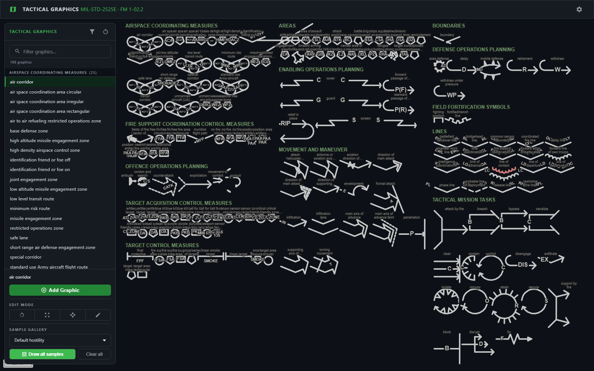

# Tactical Graphics

Render **MIL-STD-2525E / FM 1-02.2 tactical graphics** — axis-of-advance arrows, phase lines, mission tasks, range fans, boundaries — as plain **GeoJSON**.

Describe a graphic by adding a `tacticalGraphic` object to any GeoJSON feature's `properties`. Call one function. Get GeoJSON back. Draw it with OpenLayers or anything else that reads GeoJSON.

This library complements [milsymbol](https://github.com/spatialillusions/milsymbol), which renders single-point unit symbols. Tactical Graphics handles the multi-point geometries milsymbol doesn't: arrows that bend along a drawn path, corridors with parallel rails, arcs and fans sized in metres.

**[▶ Try the live demo](https://zaes-code.github.io/tactical-graphics/)** — draw any graphic, edit its handles, and set its amplifiers in the browser. No install, no sign-up.

**160 graphics** are implemented and verified today, across 12 categories — see [Supported graphics](#supported-graphics) for the full catalog, and [Upcoming graphics](#upcoming-graphics) for what's next.

---

## Install

```bash
npm install @zaes/tactical-graphics
```

The only runtime dependency is [`@turf/turf`](https://turfjs.org/).

Two entry points ship, and you can use either on its own:

| Import | What it gives you | Needs |
|---|---|---|
| `@zaes/tactical-graphics` | The geometry. GeoJSON in, GeoJSON out — no map library, no DOM. | `@turf/turf` only |
| `@zaes/tactical-graphics/openlayers` | The renderer: every style function, the 4326 → 3857 adapter, the feature holders and controllers, and a manager that wires draw/modify onto a map. | `ol` (and `milsymbol`) as peers |

```bash
npm install ol milsymbol   # only if you want the OpenLayers entry point
```

Both are peer dependencies and both are optional, so installing the package for
its geometry alone pulls in neither.

---

## Quick start

```ts
import {renderTacticalGraphic, TacticalGraphicName} from '@zaes/tactical-graphics';

const {graphic, labels, handles} = renderTacticalGraphic({
    type: 'Feature',
    geometry: {
        type: 'LineString',
        coordinates: [[-77.04, 38.89], [-76.95, 38.95]],
    },
    properties: {
        tacticalGraphic: {
            name: TacticalGraphicName.MainAxisOfAdvance,
            label: '1-508 IN',
            hostility: 'Friend',
            radius: 300,
        },
    },
});
```

`graphic` is a `MultiLineString` — the drawn symbol. `labels` is a `MultiPoint` of anchor points for text. `handles` is a `MultiPoint` of grab points an editor can expose as drag handles — usually the drawn vertices, plus shape or width points for the graphics that have them. A generator may also leave a vertex out when a handle there would be redundant or would sit under the symbol's own label.

Everything is GeoJSON, in **EPSG:4326** (`[longitude, latitude]`), in and out.

---

## The properties object

Everything the library needs lives under `properties.tacticalGraphic`. Only `name` is required; each graphic ignores the fields that don't apply to it.

```ts
properties: {
    tacticalGraphic: {
        // Required — which graphic to draw.
        name: 'MainAxisOfAdvance',

        // Amplifiers — text rendered on the graphic.
        label: '1-508 IN',        // primary designation
        secondId: 'TF RAIDER',    // secondary designation
        startDate: '021200ZJUN26',
        endDate: '021800ZJUN26',
        minAltitude: '500',
        maxAltitude: '2000',
        weapon: 'M252 81mm',      // FinalProtectiveFire only
        grid: '18SUJ2345',

        // Symbology — affects colour and dash pattern.
        hostility: 'Friend',      // Friend | Hostile/Faker | Neutral | Unknown | ...
        status: 'present',        // present | planned  (planned ⇒ dashed)
        echelon: 'battalion',
        direction: 'ONE_WAY',     // route graphics

        // Geometry, in metres.
        radius: 300,              // arrow width / circle radius
        size: 1000,               // generic size scalar (point graphics)
        rotation: 45,             // degrees (point graphics)
    },
}
```

Because the config rides on the feature, a tactical graphic is **just GeoJSON**. Save it, `POST` it, put it in PostGIS, diff it in git — then render it back with `renderTacticalGraphic()`.

The rendered output carries the same `properties.tacticalGraphic` plus a `role` of `graphic`, `label`, or `handle`, so your styling code can read a graphic's amplifiers straight off the feature it's drawing.

---

## Which geometry does a graphic need?

Each graphic expects one base geometry type. Pass the wrong one and you get a clear error rather than a broken shape.

| Base geometry | Graphics | Example |
|---|---|---|
| `LineString` | arrows, phase lines, boundaries, corridors | `MainAxisOfAdvance`, `PhaseLine` |
| `Point` | mission tasks, range fans, fighting positions | `Secure`, `Contain`, `BaseDefenseZone` |
| `Polygon` | areas | `ObjectiveArea`, `NamedAreaOfInterest` |

```ts
renderTacticalGraphic({
    type: 'Feature',
    geometry: {type: 'Point', coordinates: [-77.0, 38.9]},
    properties: {tacticalGraphic: {name: 'Secure', size: 1000, rotation: 0}},
});
```

Discover what's available at runtime:

```ts
import {listTacticalGraphicNames, GRAPHIC_CATEGORIES, getDisplayName} from '@zaes/tactical-graphics';

listTacticalGraphicNames();                     // → ['MainAxisOfAdvance', 'PhaseLine', ...]
GRAPHIC_CATEGORIES['PhaseLine'];                // → 'Lines'
getDisplayName('MainAxisOfAdvance');            // → 'main axis of advance'
```

---

## Rendering

`toFeatureCollection()` flattens a render into a `FeatureCollection` you can hand straight to a map. It returns the `graphic` and `label` features by default; ask for `handle` too when you're building an editor.

### OpenLayers — styled, drawable, editable

`@zaes/tactical-graphics/openlayers` is the renderer the demo uses. It carries
the doctrinal styling — standard identity colours, dashed planned status,
echelon glyphs, amplifier placement — plus draw and edit interactions:

```ts
import {TacticalGraphicName} from '@zaes/tactical-graphics';
import {TacticalGraphicsManager} from '@zaes/tactical-graphics/openlayers';

const manager = new TacticalGraphicsManager(map, source);
manager.startDrawing(TacticalGraphicName.MainAxisOfAdvance);
```

Or drive one graphic yourself, without the manager:

```ts
import {getController, writeGraphicProperties} from '@zaes/tactical-graphics/openlayers';

const handler = getController(TacticalGraphicName.FieldsOfFire, map.getView().getResolution());
handler.setBaseFeature(drawnFeature);          // your LineString / Polygon / Point
source.addFeatures(handler.getFeatures());     // graphic + labels + handles
writeGraphicProperties(handler.getFeatures(), TacticalGraphicName.FieldsOfFire, {
    label: 'A', hostility: 'Hostile/Faker',    // strokes turn red; text stays black
});
```

Set amplifiers through `writeGraphicProperties`, never `feature.set` —
`ol/Object.set` fires `propertychange` without calling `changed()`, so the map
can keep drawing the old label.

### OpenLayers — geometry only

If you would rather keep your own styling, skip the subpath entirely.
`renderTacticalGraphic` emits EPSG:4326, so reproject on read:

```ts
import GeoJSON from 'ol/format/GeoJSON';

const features = new GeoJSON().readFeatures(
    toFeatureCollection(renderTacticalGraphic(feature)),
    {dataProjection: 'EPSG:4326', featureProjection: 'EPSG:3857'},
);
source.addFeatures(features);
```

### Any GeoJSON renderer

The output is a standard `FeatureCollection`, so any renderer that reads GeoJSON can consume it — filter on `properties.role` (`graphic` / `label` / `handle`) to style each part. OpenLayers is the reference implementation because that is where the full MIL-STD-2525E / FM 1-02.2 styling lives; other renderers show the correct geometry but style it themselves.

### Drawing the label text

`labels` gives you **anchor points**, not rendered text — you own the typography. Read the text from the properties, or from `getLabel()` for graphics whose abbreviation is fixed by doctrine:

```ts
import {getLabel} from '@zaes/tactical-graphics';

getLabel('PhaseLine');           // → 'PL'   (doctrinal, not user-editable)
getLabel('FinalProtectiveFire'); // → 'FPF'
```

---

## Errors

`renderTacticalGraphic` throws `TacticalGraphicError` with an actionable message:

```
Feature has no "properties.tacticalGraphic" object. Add one naming the graphic,
e.g. {"tacticalGraphic": {"name": "PhaseLine"}}.

Unknown tactical graphic "AxisOfAdvnce". Call listTacticalGraphicNames() to see
the 199 supported names.

Graphic "Secure" expects a Point base geometry, got LineString.
```

---

## Coordinate systems

The library is projection-agnostic in one specific way: **it works entirely in EPSG:4326**, and hands you EPSG:4326 back. Reproject at your renderer's boundary, not before you call it.

Sizes (`radius`, `size`) are in **metres**, and range-fan band ranges are in **kilometres**.

---

## Supported graphics

The graphics below are **fully implemented and verified** — each can be drawn, labelled, rotated, resized, repositioned, and modified, with its shape and labels checked against FM 1-02.2. This is the library's real, proven capability.



*Drawn in a single sweep by the demo app's **Draw all samples** button, grouped by category — press it yourself in the [live demo](https://zaes-code.github.io/tactical-graphics/). The gallery covers every graphic whose shape and labels are verified, so it also shows a few still finishing their edit handles — slightly more than the table below lists.*

(`listTacticalGraphicNames()` returns more names than this — the registry also carries variants still being finished, listed under [Upcoming graphics](#upcoming-graphics). The table below is the verified set: drawable, correctly shaped and labelled, and fully editable.)

| Graphic | Category |
|---|---|
| Air Corridor | Airspace Coordinating Measures |
| Air-To-Air Refueling Restricted Operations Zone | Airspace Coordinating Measures |
| Airspace Coordination Area, Circular | Airspace Coordinating Measures |
| Airspace Coordination Area, Irregular | Airspace Coordinating Measures |
| Airspace Coordination Area, Rectangular | Airspace Coordinating Measures |
| Base Defense Zone | Airspace Coordinating Measures |
| High-Altitude Missile Engagement Zone | Airspace Coordinating Measures |
| High-Density Airspace Control Zone | Airspace Coordinating Measures |
| Identification, Friend-Or-Foe Switch Off-Line | Airspace Coordinating Measures |
| Identification, Friend-Or-Foe Switch On-Line | Airspace Coordinating Measures |
| Joint Engagement Zone | Airspace Coordinating Measures |
| Low-Altitude Missile Engagement Zone | Airspace Coordinating Measures |
| Low-Level Transit Route | Airspace Coordinating Measures |
| Minimum-Risk Route | Airspace Coordinating Measures |
| Missile Engagement Zone | Airspace Coordinating Measures |
| Restricted Operations Zone | Airspace Coordinating Measures |
| Safe Lane | Airspace Coordinating Measures |
| Short-Range Air Defense Engagement Zone | Airspace Coordinating Measures |
| Special Corridor | Airspace Coordinating Measures |
| Standard Use Army Aircraft Flight Route | Airspace Coordinating Measures |
| Transit Corridor | Airspace Coordinating Measures |
| Unmanned Aircraft (UA) Corridor | Airspace Coordinating Measures |
| Unmanned Aircraft Restricted Operations Zone | Airspace Coordinating Measures |
| Weapon Engagement Zone | Airspace Coordinating Measures |
| Weapons Free Zone | Airspace Coordinating Measures |
| Airfield | Areas |
| Airhead Line | Areas |
| Area Of Operations | Areas |
| Assault Position | Areas |
| Assembly Area | Areas |
| Attack Position | Areas |
| Base Camp | Areas |
| Battle Position | Areas |
| Battle Position Planned But Not Prepared | Areas |
| Battle Position Prepared But Not Occupied | Areas |
| Brigade Support Area | Areas |
| Corps Support Area | Areas |
| Detainee Holding Area | Areas |
| Division Support Area | Areas |
| Drop Zone | Areas |
| Encirclement | Areas |
| Engagement Area | Areas |
| Fortified Area | Areas |
| Forward Arming And Refueling Point | Areas |
| Guerrilla Base | Areas |
| Kill Zone | Areas |
| Landing Zone | Areas |
| Named Area Of Interest | Areas |
| Objective Area | Areas |
| Pickup Zone | Areas |
| Refugee Holding Area | Areas |
| Strong Point | Areas |
| Target Area Of Interest | Areas |
| Unexploded Explosive Ordnance (UXO) Area | Areas |
| Enemy Known Boundary | Boundaries |
| Enemy Suspected Boundary | Boundaries |
| Friendly Planned Boundary | Boundaries |
| Friendly Present Boundary | Boundaries |
| Area Defense | Defense Operations Planning |
| Delay | Defense Operations Planning |
| Mobile Defense | Defense Operations Planning |
| Retirement | Defense Operations Planning |
| Withdraw | Defense Operations Planning |
| Withdraw Under Pressure | Defense Operations Planning |
| Cover | Enabling Operations Planning |
| Forward Passage Of Lines | Enabling Operations Planning |
| Guard | Enabling Operations Planning |
| Rearward Passage Of Lines | Enabling Operations Planning |
| Relief In Place | Enabling Operations Planning |
| Screen | Enabling Operations Planning |
| Fighting Position | Field Fortification Symbols |
| Fortified/Trench Line | Field Fortification Symbols |
| Fields Of Fire/Sector Of Fire | Fire Support Coordination Control Measures |
| Free-Fire Area, Circular | Fire Support Coordination Control Measures |
| Free-Fire Area, Irregular | Fire Support Coordination Control Measures |
| Free-Fire Area, Rectangular | Fire Support Coordination Control Measures |
| Munition Flight Path (MFP) | Fire Support Coordination Control Measures |
| No-Fire Area, Circular | Fire Support Coordination Control Measures |
| No-Fire Area, Irregular | Fire Support Coordination Control Measures |
| No-Fire Area, Rectangular | Fire Support Coordination Control Measures |
| Position Area For Artillery, Circular | Fire Support Coordination Control Measures |
| Position Area For Artillery, Irregular | Fire Support Coordination Control Measures |
| Position Area For Artillery, Rectangular | Fire Support Coordination Control Measures |
| Restrictive Fire Area, Circular | Fire Support Coordination Control Measures |
| Restrictive Fire Area, Irregular | Fire Support Coordination Control Measures |
| Restrictive Fire Area, Rectangular | Fire Support Coordination Control Measures |
| Battlefield Handover Line | Lines |
| Bridgehead Line | Lines |
| Common Sensor Boundary | Lines |
| Coordinated Fire Line | Lines |
| Delay Line | Lines |
| Engineer Work Line | Lines |
| Final Coordination Line | Lines |
| Fire Support Coordination Line | Lines |
| Forward Edge Of The Battle Area | Lines |
| Forward Line Of Own Troops | Lines |
| Intelligence Coordination Line | Lines |
| Limit Of Advance | Lines |
| Line Of Contact | Lines |
| Line Of Departure | Lines |
| Line Of Departure Or Line Of Contact | Lines |
| Phase Line | Lines |
| Probable Line Of Deployment | Lines |
| Release Line | Lines |
| Restrictive Fire Line | Lines |
| Airborne Or Aviation Axis Of Advance | Movement and Maneuver |
| Attack Helicopter Axis Of Advance | Movement and Maneuver |
| Aviation Direction Of Attack | Movement and Maneuver |
| Direction Of Main Attack | Movement and Maneuver |
| Direction Of Main Attack Feint | Movement and Maneuver |
| Direction Of Supporting Attack | Movement and Maneuver |
| Envelopment | Movement and Maneuver |
| Frontal Attack | Movement and Maneuver |
| Infiltration | Movement and Maneuver |
| Infiltration Lane | Movement and Maneuver |
| Main Axis Of Advance | Movement and Maneuver |
| Main Axis Of Advance Feint | Movement and Maneuver |
| Penetration | Movement and Maneuver |
| Supporting Axis Of Advance | Movement and Maneuver |
| Turning Movement | Movement and Maneuver |
| Ambush | Offense Operations Planning |
| Cordon And Search | Offense Operations Planning |
| Counterattack | Offense Operations Planning |
| Exploitation | Offense Operations Planning |
| Movement To Contact | Offense Operations Planning |
| Pursuit | Offense Operations Planning |
| Attack By Fire | Tactical Mission Tasks |
| Block | Tactical Mission Tasks |
| Breach | Tactical Mission Tasks |
| Bypass | Tactical Mission Tasks |
| Canalize | Tactical Mission Tasks |
| Clear | Tactical Mission Tasks |
| Contain | Tactical Mission Tasks |
| Control | Tactical Mission Tasks |
| Disengage | Tactical Mission Tasks |
| Disrupt | Tactical Mission Tasks |
| Exfiltrate | Tactical Mission Tasks |
| Fix | Tactical Mission Tasks |
| Isolate | Tactical Mission Tasks |
| Occupy | Tactical Mission Tasks |
| Retain | Tactical Mission Tasks |
| Secure | Tactical Mission Tasks |
| Support By Fire | Tactical Mission Tasks |
| Artillery Target Intelligence Zone, Circular | Target Acquisition Control Measures |
| Artillery Target Intelligence Zone, Irregular | Target Acquisition Control Measures |
| Artillery Target Intelligence Zone, Rectangular | Target Acquisition Control Measures |
| Blue Kill Box, Circular | Target Acquisition Control Measures |
| Blue Kill Box, Irregular | Target Acquisition Control Measures |
| Blue Kill Box, Rectangular | Target Acquisition Control Measures |
| Call For Fire Zone, Circular | Target Acquisition Control Measures |
| Call For Fire Zone, Irregular | Target Acquisition Control Measures |
| Call For Fire Zone, Rectangular | Target Acquisition Control Measures |
| Censor Zone, Circular | Target Acquisition Control Measures |
| Censor Zone, Irregular | Target Acquisition Control Measures |
| Censor Zone, Rectangular | Target Acquisition Control Measures |
| Critical Friendly Zone, Circular | Target Acquisition Control Measures |
| Critical Friendly Zone, Irregular | Target Acquisition Control Measures |
| Critical Friendly Zone, Rectangular | Target Acquisition Control Measures |
| Dead Space Area, Circular | Target Acquisition Control Measures |
| Dead Space Area, Irregular | Target Acquisition Control Measures |
| Dead Space Area, Rectangular | Target Acquisition Control Measures |
| Purple Kill Box, Circular | Target Acquisition Control Measures |
| Purple Kill Box, Irregular | Target Acquisition Control Measures |
| Purple Kill Box, Rectangular | Target Acquisition Control Measures |
| Weapon Or Sensor Range Fan | Target Acquisition Control Measures |
| Weapon Or Sensor Range Fan, Circular | Target Acquisition Control Measures |
| Final Protective Fire | Target Control Measures |
| Fire Support Area, Circular | Target Control Measures |
| Fire Support Area, Irregular | Target Control Measures |
| Fire Support Area, Rectangular | Target Control Measures |
| Group/Series Of Targets | Target Control Measures |
| Linear Smoke Target | Target Control Measures |
| Linear Target | Target Control Measures |
| Smoke Obscurant | Target Control Measures |
| Target Area, Circular | Target Control Measures |
| Target Area, Irregular | Target Control Measures |
| Target Area, Rectangular | Target Control Measures |

---

## Upcoming graphics

Everything still being worked towards. A graphic is listed here until it is drawable, its shape and labels are signed off against FM 1-02.2, **and** its edit handles are finished — so this covers both graphics that have not been started and ones that are partly done. Several are already selectable in the demo app; treat anything here as work in progress rather than capability.

| Graphic | Category |
|---|---|
| Limited Access Area | Areas |
| Abatis | Mobility and Countermobility Control Measures |
| Alternate Supply Route | Mobility and Countermobility Control Measures |
| Alternate Supply Route, Alternating Traffic | Mobility and Countermobility Control Measures |
| Alternate Supply Route, One-Way Traffic | Mobility and Countermobility Control Measures |
| Alternate Supply Route, Two-Way Traffic | Mobility and Countermobility Control Measures |
| Alternating Traffic Route | Mobility and Countermobility Control Measures |
| Anti-Tank Ditch - Completed | Mobility and Countermobility Control Measures |
| Anti-Tank Ditch - Under Construction | Mobility and Countermobility Control Measures |
| Anti-Tank Ditch Reinforced, With Anti-Tank Mines | Mobility and Countermobility Control Measures |
| Assault Crossing | Mobility and Countermobility Control Measures |
| Block | Mobility and Countermobility Control Measures |
| Bridge | Mobility and Countermobility Control Measures |
| Disrupt | Mobility and Countermobility Control Measures |
| Double Apron Fence | Mobility and Countermobility Control Measures |
| Double Fence | Mobility and Countermobility Control Measures |
| Double Strand Concertina | Mobility and Countermobility Control Measures |
| Explosives, Planned State Of Readiness | Mobility and Countermobility Control Measures |
| Explosives, State Of Readiness 1 (safe) | Mobility and Countermobility Control Measures |
| Explosives, State Of Readiness 2 (armed But Passable) | Mobility and Countermobility Control Measures |
| Ferry Crossing | Mobility and Countermobility Control Measures |
| Fix | Mobility and Countermobility Control Measures |
| Ford, Difficult | Mobility and Countermobility Control Measures |
| Ford, Easy | Mobility and Countermobility Control Measures |
| Gap | Mobility and Countermobility Control Measures |
| Halted Convoy | Mobility and Countermobility Control Measures |
| High Wire Fence | Mobility and Countermobility Control Measures |
| Low Wire Fence | Mobility and Countermobility Control Measures |
| Main Supply Route | Mobility and Countermobility Control Measures |
| Main Supply Route, Alternating Traffic | Mobility and Countermobility Control Measures |
| Main Supply Route, One-Way Traffic | Mobility and Countermobility Control Measures |
| Main Supply Route, Two-Way Traffic | Mobility and Countermobility Control Measures |
| Moving Convoy | Mobility and Countermobility Control Measures |
| Obstacle Belt | Mobility and Countermobility Control Measures |
| Obstacle Free Area | Mobility and Countermobility Control Measures |
| Obstacle Group | Mobility and Countermobility Control Measures |
| Obstacle Line | Mobility and Countermobility Control Measures |
| Obstacle Restricted Area | Mobility and Countermobility Control Measures |
| Obstacle Zone | Mobility and Countermobility Control Measures |
| One-Way Traffic Route | Mobility and Countermobility Control Measures |
| Passage Lane | Mobility and Countermobility Control Measures |
| Roadblock Complete (executed) | Mobility and Countermobility Control Measures |
| Route | Mobility and Countermobility Control Measures |
| Single Concertina | Mobility and Countermobility Control Measures |
| Single Fence | Mobility and Countermobility Control Measures |
| Triple Strand Concertina | Mobility and Countermobility Control Measures |
| Turn | Mobility and Countermobility Control Measures |
| Unspecified | Mobility and Countermobility Control Measures |
| Destroy | Tactical Mission Tasks |
| Follow And Assume | Tactical Mission Tasks |
| Follow And Support | Tactical Mission Tasks |
| Interdict | Tactical Mission Tasks |
| Neutralize | Tactical Mission Tasks |
| Seize | Tactical Mission Tasks |
| Suppress | Tactical Mission Tasks |
| Turn | Tactical Mission Tasks |

---

## Project layout

```
src/tacticalgraphics/          # The library. Pure GeoJSON, map-agnostic.
  index.ts                     #   public entry point
  core/render.ts               #   renderTacticalGraphic()
  core/type.ts                 #   TacticalGraphicName + the properties schema
  core/GeometryService.ts      #   all geographic math (turf + custom)
  core/TacticalGraphicsRegistry.ts
  graphics/                    #   one generator class per graphic family

src/components/
  openlayers/                  # Published as @zaes/tactical-graphics/openlayers:
                               #   styling, the 4326→3857 adapter, draw/edit
  MapControls.tsx, …           # The React demo — not published.
```

The demo application is built on **OpenLayers** — it shows drawing, editing, rotating, resizing, modifying, and a Feature Properties dialog, on a keyless OpenStreetMap basemap (no API key needed). Start it with `npm start`.

The geometry layer is renderer-agnostic — it emits GeoJSON, so any renderer that reads GeoJSON can draw it (see [Rendering](#rendering)) — and it never imports `ol`, which the build asserts. The OpenLayers styling ships beside it as an optional entry point; matching that styling pixel-for-pixel on another renderer is a per-renderer effort left to consumers.

---

## Development

```bash
npm start            # run the demo app
npm test             # run the test suite
npx tsc --noEmit     # typecheck (the main correctness gate)
npm run lint         # eslint --fix
```

The generators in `src/tacticalgraphics/graphics/` are the reference for new
shapes, and the OpenLayers demo under `src/components/openlayers/` shows how a
renderer consumes them. See **Adding a graphic** below for the steps.

---

## Adding a graphic

1. Add the name to `TacticalGraphicName` in `core/type.ts`.
2. Write a generator in `graphics/`, extending `TacticalGraphicsBase`.
3. Register it in `core/TacticalGraphicsRegistry.ts`.
4. Add it to `GRAPHIC_CATEGORIES` in `core/categories.ts`.

Steps 1 and 4 are enforced by the compiler — `GRAPHIC_CATEGORIES` is an exhaustive
`Record<TacticalGraphicName, …>`, so TypeScript tells you what's missing. To wire
the graphic into the demo app you also need entries in
`controllerRegistry.ts` and `graphicFieldRegistry.ts`.

A graphic is "done" when a user can draw it, label it, and rotate, resize,
reposition, and modify it.

---

## Roadmap

- Complete the remaining graphics from FM 1-02.2.
- A Cesium 2D/3D view is planned once the OpenLayers graphics are complete. The OpenLayers style functions already read their amplifiers (label, hostility, status, DTGs) from `properties.tacticalGraphic`, but the styling *logic* is still OpenLayers-specific code — a second renderer would first need that logic expressed as portable, renderer-agnostic data.

---

## References

- [FM 1-02.2, Military Symbols](https://www.battleorder.org/post/symbolsfm) — US Army
- [DoD Joint Military Symbology (MIL-STD-2525E)](https://quicksearch.dla.mil/qsDocDetails.aspx?ident_number=114934)
- [TurfJS](https://turfjs.org/) — the geospatial math underneath

## Contributors

- **Edwin Sanchez** — maintainer
- **Eric Marks**
- **Navie Huynh** — past contributor

Commit-level credit lives in the [contributors graph](https://github.com/zaes-code/tactical-graphics/graphs/contributors).

## License

MIT
