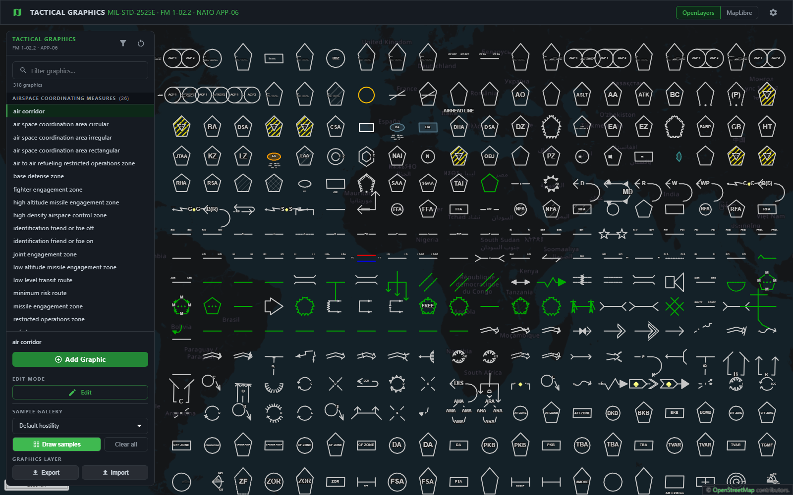

# Tactical Graphics

Render **MIL-STD-2525E / FM 1-02.2 / APP-06 tactical graphics** (axis-of-advance arrows, phase lines, mission tasks, range fans, boundaries) as plain **GeoJSON**, and draw and edit them on **OpenLayers** or **MapLibre**.

It complements [milsymbol](https://github.com/spatialillusions/milsymbol), which draws single-point unit symbols: this library draws the multi-point graphics milsymbol does not.

**[Documentation](https://zaes.com/docs/tactical-graphics/)** · **[Live demo](https://zaes-code.github.io/tactical-graphics/)** · [Changelog](CHANGELOG.md)



## Install

```bash
npm install @zaes/tactical-graphics
```

Add `ol` or `maplibre-gl` to draw on a map, and `milsymbol` for the few graphics with a center symbol. All three are optional peers.

## Quick start

```ts
import {renderTacticalGraphic, TacticalGraphicName} from '@zaes/tactical-graphics';

const {graphic, labels, handles} = renderTacticalGraphic({
    type: 'Feature',
    geometry: {type: 'LineString', coordinates: [[-77.04, 38.89], [-76.95, 38.95]]},
    properties: {
        tacticalGraphic: {name: TacticalGraphicName.MainAxisOfAdvance, designation: '1-508 IN', hostility: 'Friend', width: 300},
    },
});
```

You get the drawn symbol, its label anchors and its edit handles back, as GeoJSON in EPSG:4326. To draw, style and edit graphics on a map instead, see [Rendering](https://zaes.com/docs/tactical-graphics/guide/rendering.html). Everything else, from the `tacticalGraphic` object's fields to every export, is in the [documentation](https://zaes.com/docs/tactical-graphics/).

## License

MIT. Made by [Zaes](https://zaes.com).
